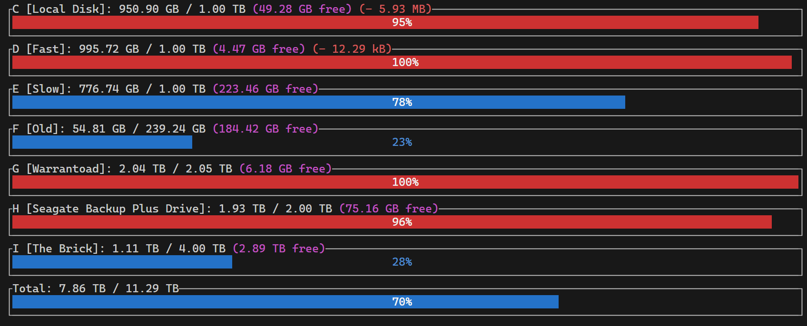

# total-space

A modern Rust terminal tool for visualizing and monitoring disk space usage across all your Windows drives.

## Features
- **Per-drive and total disk usage gauges**: See a real-time, color-coded TUI gauge for each drive (C, D, E, F, G, H, I) and the total.
- **Accurate, human-friendly units**: Uses strongly-typed byte counts (uom) and human-readable formatting (e.g., GB, TB).
- **Color-coded alerts**: Gauges turn red if a drive is low on space (<100GB or <10% free), blue otherwise. Delta changes are green (gaining free space) or red (losing free space).
- **Live delta tracking**: Shows how much free space has changed since the program started, with deltas and current free space displayed for each drive.
- **Snapshot history**: Keeps all disk usage snapshots in memory for future charting or analysis.
- **Keyboard controls**: Press `r` to refresh immediately, `q` or `Esc` to exit.

## Example



## Usage

1. Build and run the program with Cargo:
   ```sh
   cargo run --release
   ```
2. View your drives' space usage in a live terminal dashboard.
3. Press `r` to refresh, `q` or `Esc` to quit.

---

Built with [ratatui](https://github.com/ratatui/ratatui), [windows-rs](https://github.com/microsoft/windows-rs), [uom](https://github.com/iliekturtles/uom), and [humansize](https://github.com/LeopoldArkham/humansize).